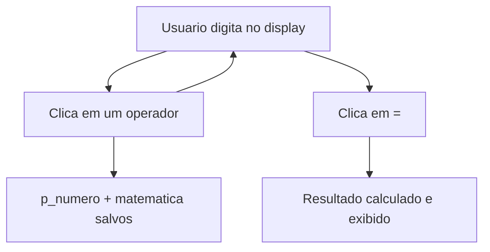

# 🧮 Calculator-with-GUI-in-Python
<p align="center">
  
  <a href="https://github.com/panda12332145/calculator-with-gui-in-python/commits/main"></a>
  <a href="https://github.com/panda12332145/calculator-with-gui-in-python"></a>
  
</p>
---
## 🔖 Resumo

Calculadora gráfica em **Python com Tkinter**, com interface visual de botões para as quatro operações básicas (soma, subtração, multiplicação e divisão) e uso de variáveis globais para guardar o primeiro operando. Projeto introdutório de GUI construído sem framework externo — apenas a biblioteca padrão.

### ✨ Funcionalidades Principais

- ✅ Interface gráfica com botões e display (Tkinter)
- ✅ As 4 operações aritméticas básicas
- ✅ Estado da operação mantido em variáveis globais (`p_numero`, `matematica`)
- ✅ Zero dependências externas (só stdlib)

## 📽 Demonstração


```text
$ python CalculadoraComGui.py
[Janela 'CalculadoraComGUI' com display + botões 0-9 + / * - + = ]
```

## ⚙️ Explicação das Partes Importantes

### Clique de operador (`click_divi` e cia.)

```python
def click_divi():
    global p_numero, matematica
    primeiro_numero = tela.get()
    matematica = "divisao"
    p_numero = float(primeiro_numero)
    tela.delete(0, END)
```

> Salva o primeiro número e o operador escolhido; o display é limpo para receber o segundo número.

### Clique do igual (`click_igual`)

```python
def click_igual():
    segundo_numero = tela.get()
    if matematica == "soma":
        tela.insert(0, p_numero + float(segundo_numero))
    # subtracao / multiplicacao / divisao ...
```

> Recupera o segundo número, aplica a operação guardada e mostra o resultado no display.

## 🔄 Fluxo de Trabalho / Arquitetura



## 📂 Estrutura do Projeto

```plaintext
calculator-with-gui-in-python/
├── CalculadoraComGui.py   # Código-fonte (Tkinter)
├── Menu.jpg               # Print da interface
└── README.md
```

## 🛠️ Tecnologias

| Ferramenta | Uso |
|---|---|
| **Python 3** | Linguagem |
| **Tkinter** | GUI nativa do Python |
| **functools/math** | Auxiliares usados no script |

## ▶️ Instalação

```bash
git clone https://github.com/panda12332145/calculator-with-gui-in-python.git
cd calculator-with-gui-in-python
# sem dependências externas — Tkinter vem com o Python
```

## 🚀 Execução

```bash
python CalculadoraComGui.py
```

## ⚠️ Limitações

- Sem validação de divisão por zero
- Estado em variáveis globais (sem POO)
- Interface em português fixa

## 🚀 Roadmap

- [ ] Tratar divisão por zero
- [ ] Adicionar teclado físico
- [ ] Refatorar para classes

## 📄 Licença

Todos os direitos reservados ao autor.

---

## 👾 Autor

<p align="center">
  
</p>

<p align="center">Feito por <strong>Panda12332145</strong> 👋🏽</p>

---

## 🧑‍💻 Sobre Mim

Sou apaixonado por **Física Teórica, Cibersegurança e Desenvolvimento de Sistemas**. Tenho grande interesse em programação de baixo nível, engenharia reversa, automação, sistemas Windows, criptografia e segurança ofensiva. Também gosto bastante de música, filosofia e computação avançada.

---

## 🌐 Redes

* **Site:** [https://panda-h0me.netlify.app/](https://panda-h0me.netlify.app/)
* **YouTube:** [https://www.youtube.com/@X86BinaryGhost](https://www.youtube.com/@X86BinaryGhost)
* **Instagram:** [https://www.instagram.com/01pandal10/](https://www.instagram.com/01pandal10/)
* **GitHub:** [https://github.com/panda12332145](https://github.com/panda12332145)
* **LinkedIn:** [linkedin.com/in/athos-da-boanergis](https://www.linkedin.com/in/athos-d%C3%A3-boanergis-5585a4288/)

---

## 🚀 Áreas de Interesse

* **Cibersegurança Avançada** 🔒
* **Hacking & Engenharia Reversa** 💻
* **Computação de Baixo Nível** 🖥️
* **Matemática e Física Teórica** 📐⚛️
* **Desenvolvimento de Ferramentas de Segurança** 🛠️

_"Conhecimento é poder, e domínio técnico vem da compreensão profunda dos sistemas."_

---

## 📞 Contato & Suporte

Para colaborações, dúvidas ou sugestões:

📧 **E-mail:** [athos.cybersec@gmail.com](mailto:athos.cybersec@gmail.com)

🐛 **Reportar Bug:** [Abrir Issue](https://github.com/panda12332145/calculator-with-gui-in-python/issues)

💡 **Sugerir Melhoria:** [Discussions](https://github.com/panda12332145/calculator-with-gui-in-python/discussions)

## 📊 Métricas

<!-- metrics:start -->
| Métrica | Valor |
|---|---|
| ⭐ Stars | 0 |
| 🍴 Forks | 0 |
| 📌 Issues abertas | 0 |
| 🕐 Último commit | 2026-09-29 |
<!-- metrics:end -->
